Instalación y configuración de Software Kleopatra.
=========

- Se debe descargar GPG4win para windows.

- Procedemos a realizar la instalación a través del ejecutable, el cual incluirá kleopatra:

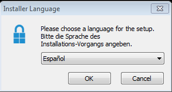

.. image:: ../imagenes/instalacion/Selección_071.png

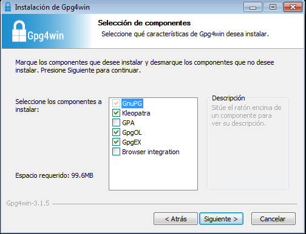

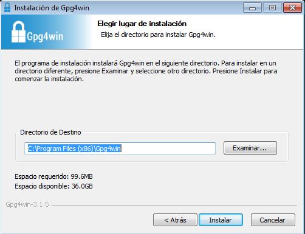

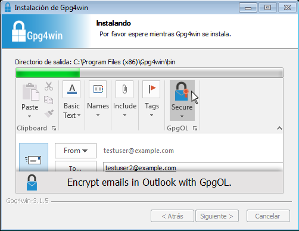

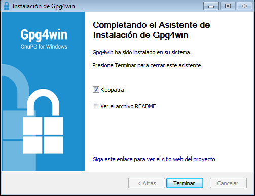

- Ya podemos ingresar al software Kleopatara:

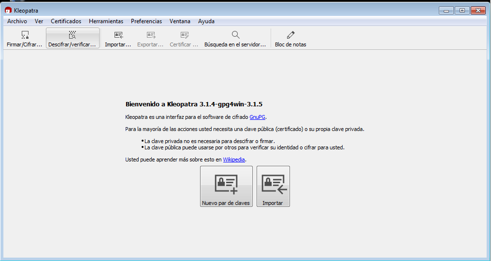

- Procedemos a crear nuestros par de claves pública y privada (la clave pública servirá para cifrar los archivos y la privada para descifralos):

- Le damos a la opción Archivo y luego Nuevo par de claves:

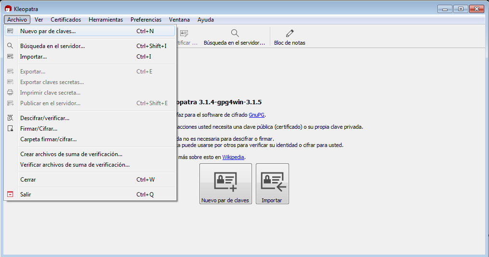

- Seguidamente Crear un par de claves personales OpenPGP:

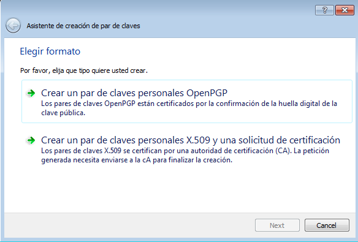

- Colocamos el nombre del propietario de las claves y su correo:  

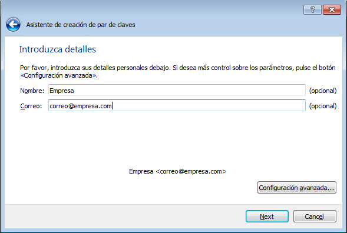

- En configuraciones avanzadas podemos definir el material de clave y la fecha de expiración de las mismas:

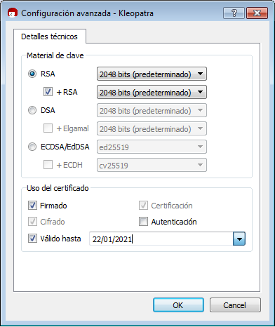

- Verificamos los parámetros de revisión y de estar bien procedemos a crear:

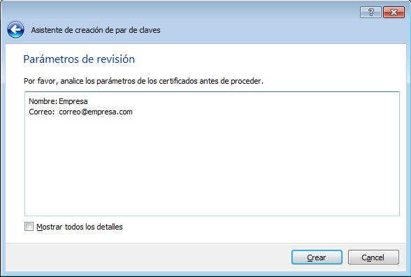

- Nos solicitará la contraseña para la clave privada:

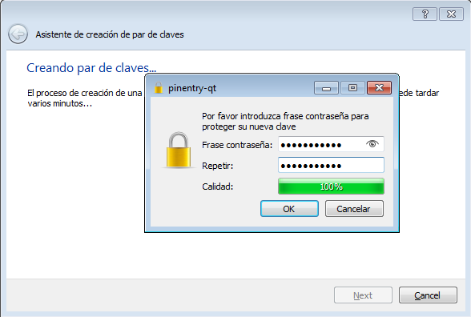

- Seleccionamos la opción de Hacer copia de respaldo de su par de clave y las guardamos en un sitio seguro:

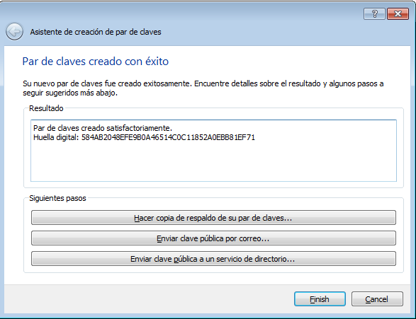

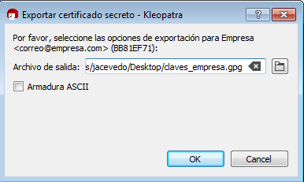

- Nos solicitará la contraseña ingresada anteriormente para poder exportar la clave privada:

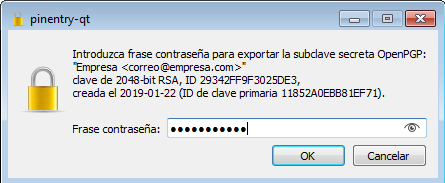

- Luego nos mostrará un mensaje que la clave fue exportada con éxito:

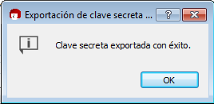

- Y finalizamos la creación:

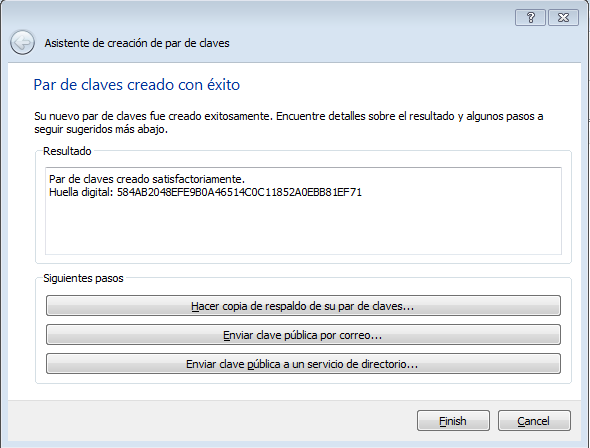

- Como podemos ver el par de claves fueron creadas satisfactoriamente:

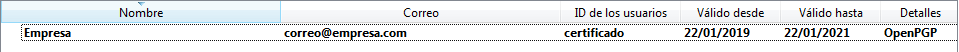

NOTA: Para que alguien nos envíe un archivo cifrado debemos suministrarle nuestra clave pública, nunca nuestra clave privada. La clave privada es la que nos servirá para descifrar los archivos.

Obtener Clave Pública
+++++++

- Para obtener la llave pública primero seleccionamos las claves de la empresa, le damos a la opción Archivo y luego Exportar:

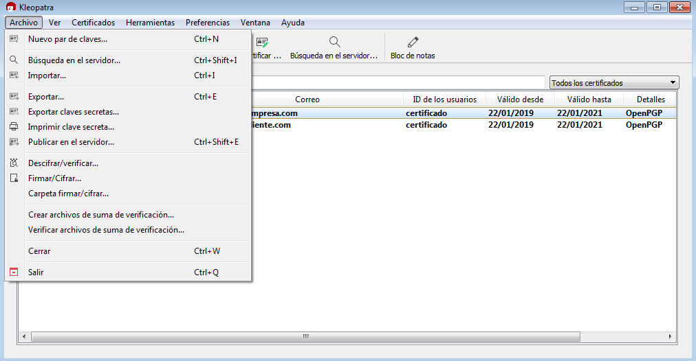

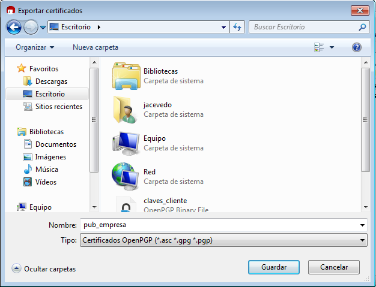

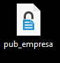

Obtener par de Claves Pública y Privada
++++++++

- Simplemente las obtenemos con el respaldo que hicimos de nuestro par de claves durante la creación. En caso de que no tengamos a disposición el respaldo, la clave pública la obtenemos como se explicó anteriormente y la clave privada la obtenemos de la siguiente manera:

	- Seleccionamos el certificado que queramos. Le damos a la opción Archivo y luego Exportar claves secretas:

	
	.. image:: ../imagenes/cliente1/Selección_070.png

	- Nos solicitará el nombre del archivo a donde queremos exportar la clave privada:

	.. image:: ../imagenes/cliente1/Selección_071.png

	- Nos solicitará la contraseña de la clave privada:

	.. image:: ../imagenes/cliente1/Selección_072.png

	- Nos mostrará un mensaje que la clave secreta fue exportada con éxito:

	.. image:: ../imagenes/cliente1/Selección_073.png

Intercambio Bidireccional
+++++++++

- En caso de que necesitemos el intercambio bidireccional con un cliente, debemos generar un nuevo par de claves pública y privada para el cliente, tal cual como generamos las de la Empresa; y suministrarles dichas claves, obteniendolas como se explicó en **Obtener par de Claves Pública y Privada**.

- El cliente debe importar esas claves de la siguiente manera (si se tiene el respaldo se realizan estos pasos pero con dicho respaldo):

	
	- Le damos a la opción Archivos y luego importar:

	
	.. image:: ../imagenes/cliente1/Selección_074.png

	- Seleccionamos la llave privada de donde la tengamos, que incluye tambien la llave pública:

	.. image:: ../imagenes/cliente1/Selección_075.png

	- Nos muestra un mensaje de que se ha importado y si deseamos establecer el nivel de confianza:

	.. image:: ../imagenes/cliente1/Selección_076.png

	- Veremos el resultado de la importación:

	.. image:: ../imagenes/cliente1/Selección_077.png

	- Ya veremos el certificado cargado en Kleopatra:

	.. image:: ../imagenes/cliente1/Selección_078.png

Canales para transmitir un mensaje/archivo cifrado.
+++++++++

Un mensaje/archivo cifrado se puede transmitir por cualquier medio que permita llegar al destinatario. Los más comunes son vía correo, scp, ftp, sftp, ftps, http, https, entre otros.

Si se quiere realizar la copia de archivos a través de scp en un Sistema Operativo Windows, se debe instalar y configurar el software Cygwin, que es el medio que utilizaremos en este caso.

Instalación y configuración de Cygwin
+++++++

- A continuación mostramos el link para la instalación de Cygwin:

Instalación de Cygwin: `enlace`__.

__ https://github.com/jesusacev/Cygwin/blob/master/guia/instalacion.rst

- Seguidamente, realizamos la configuración de Openssh a través de este link:

Configuración de Openssh: `enlace`__.

__ https://github.com/jesusacev/Cygwin/blob/master/guia/configuracion.rst

Transferencia de archivos cifrada.
+++++++++

Ahora realizaremos una ejemplificación de como realizar un envío entre la empresa y un cliente:

- Primero debemos crear un usuario para el cliente que vamos a realizar el envío:

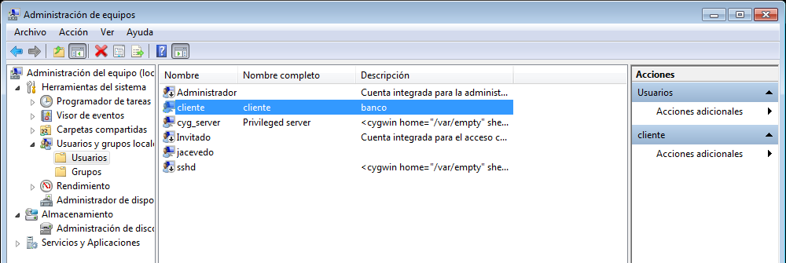

- Hacemos inicio de sesión con dicho usuario:

.. image:: ../imagenes/scp/Selección_073.png

- Debemos crear una estructura de directorios para el cliente, en la partición que tengamos más espacio (en nuestro caso c), y colocar una carpeta "IN" y otra "OUT", para diferenciar los mensajes de entrada y de salida:

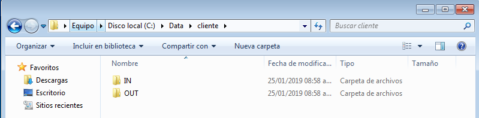

-Luego creamos un enlace simbólico del home directory del usuario con la carpeta que creamos, a través del Cygwin:

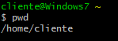

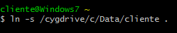

- Para otorgarle seguridad a dicha carpeta, sólo le daremos permisos de control total al usuario que creamos para el cliente. Con esto, ningún otro usuario podrá visualizar el contenido de ese directorio:

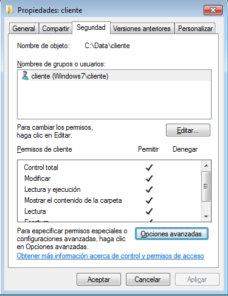

- Procedemos a crear un archivo que es el que cifraremos y enviaremos al cliente:

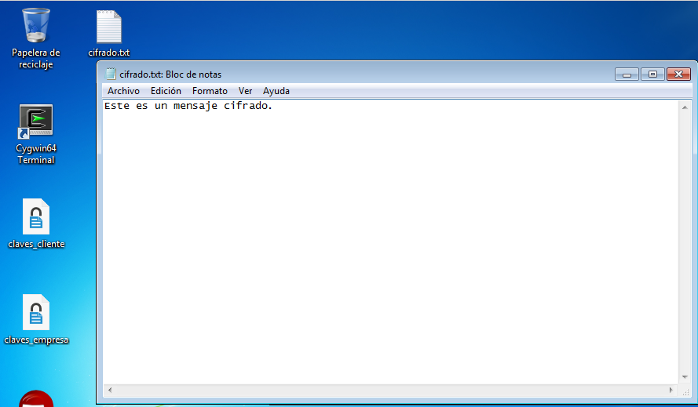

- Luego en Kleopatra, seleccionamos el certificado del cliente, le damos a la opción Archivo y seguidamente a Firmar/Cifrar:

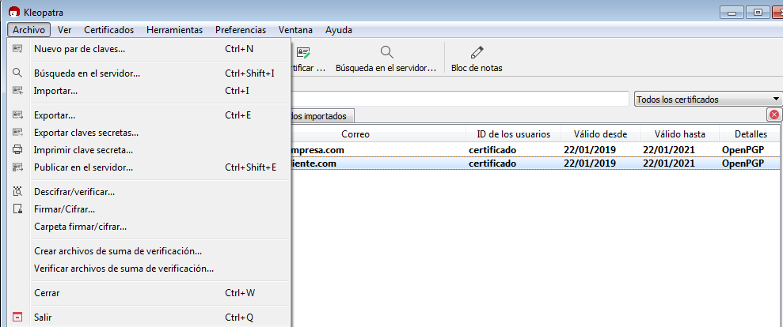

- Seleccionamos el archivo que queremos cifrar:

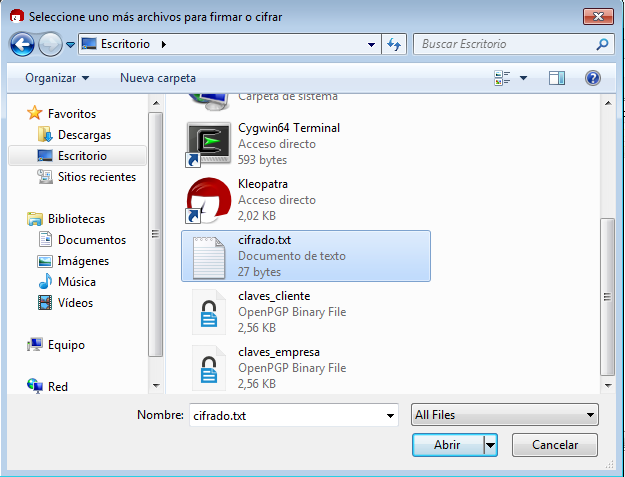

- Ciframos para otros con la llave pública del cliente:

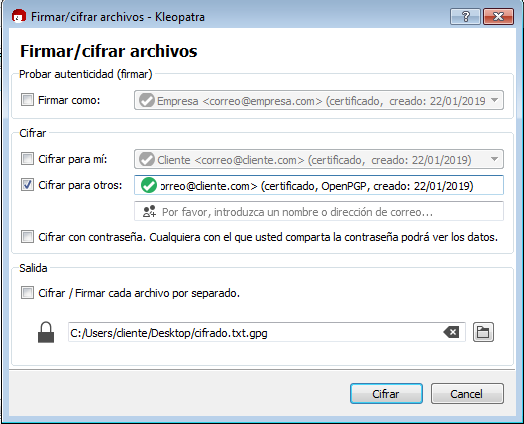

- Sí todo salió bien, nos debe mostrar un mensaje que el cifrado tuvo éxito:

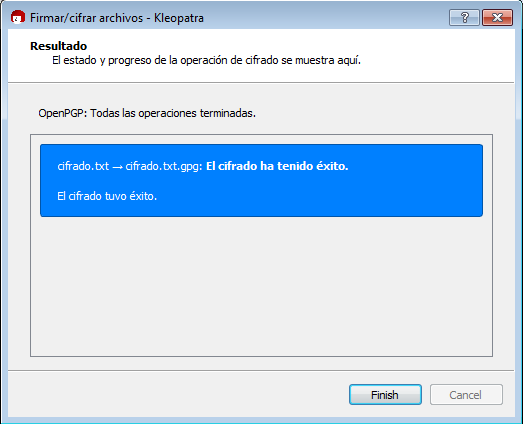

- Nos crea otro archivo, que si buscamos de visualizarlo con un bloc de notas, nos mostrará algo parecido a esto, que evidencia que el archivo está cifrado:

.. image:: ../imagenes/scp/Selección_083.png

- El archivo cifrado, lo movemos a la estructura de directorios que creamos, en la carpeta "OUT", ya que va a ser enviado al cliente:

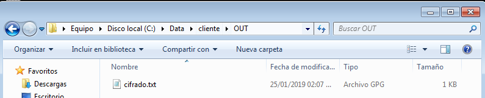

- Luego en el Cygwin nos vamos al home directory del usuario, donde ya creamos un enlace simbólico hacia la estructura de directorios, para poceder a realizar el scp. Del lado del cliente debe estar creada una estructura de directorios similar para realizar el envío::

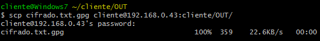

NOTA: En este caso estamos realizando el envío del archivo hacia un equipo con linux, por lo que el sistema operativo no es un impedimento.

- Si verificamos en el servidor del cliente ya tenemos el archivo cifrado:

.. image:: ../imagenes/scp/Selección_085.png

- Y procedemos a descifrarlo y mandar su salida a un archivo, teniendo la llave privada importada del cliente por supuesto (nos pedirá la contraseña)::

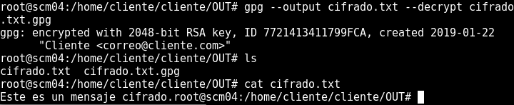

- Si el cliente nos quiere enviar un mensaje cifrado debe tener nuestra llave publica (Empresa), e implementar un procedimento similar al que se utilizó para enviarles el archivo.

